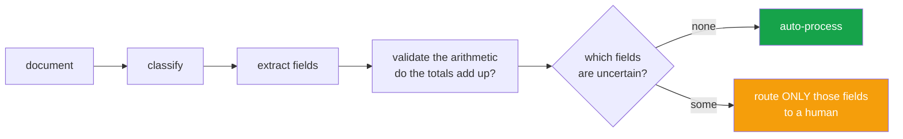

<h1 align="center">doc-intelligence-api (FastAPI · Pydantic · Jinja2)</h1>
<p align="center"><i>Document processing that sends a human one question, not one document</i></p>

<p align="center">
  <a href="#two-ideas-that-decide-whether-idp-is-worth-deploying">Two ideas</a> &middot;
  <a href="#confidence-that-means-something">Confidence</a> &middot;
  <a href="#pakistani-formats-because-most-idp-tools-dont-know-them">Pakistani formats</a> &middot;
  <a href="#the-metric-the-business-case-rests-on">The metric</a> &middot;
  <a href="#usage">Usage</a> &middot;
  <a href="#problems-hit-while-building-this">Problems hit</a>
</p>

<p align="center">
  <a href="https://github.com/hammasbuilds/doc-intelligence-api/actions/workflows/ci.yml"></a>
  
  
  
  <a href="LICENSE"></a>
</p>

---

## Two ideas that decide whether IDP is worth deploying



The difference that decides whether IDP is worth deploying: a human reviews **one field**,
not one document. Validating the arithmetic is what makes per-field confidence mean
something.


### 1. Validation catches what confidence never will

```
line items:   12,000 + 8,500 + 3,200  =  23,700
stated total:                            27,300
```

Every field here might have been read at 99% confidence. The document is still wrong —
a line was dropped, or the invoice does not add up. **Arithmetic consistency catches
errors no per-character confidence can see**, because each individual read was fine.

That is the cheapest quality signal in document processing and the one most systems skip.
Checks here:

- line items sum to the subtotal
- `subtotal + tax − discount = total`
- due date does not precede invoice date *(a misread year, every time)*
- implied tax rate is a statutory rate — **1.7% instead of 17% is a decimal point in the
  wrong place, the most common numeric OCR error and the least likely to look wrong**

### 2. Routing is per field, not per document

A forty-field invoice with one uncertain field is not a failed extraction. Rejecting the
whole document sends a human forty fields to re-key when they needed to check one — and
that is the difference between a system that saves money and one that quietly costs more
than the manual process it replaced.

So the queue carries the **specific question**:

```
"total = '99,999.00'. subtotal 23700.00 + tax 4029.00 = 27729.00,
 but total states 99999.00"
```

not *"please review this invoice"*.

**Critical fields escalate; non-critical ones do not.** A misread address is a nuisance.
A misread total is money. Treating them identically is how a review queue becomes a
backlog nobody works.

And **validation errors escalate regardless of confidence** — an invoice whose line items
don't sum to its total is wrong even if every character was read perfectly. Confidence
has nothing to say about it.

## Confidence that means something

An OCR engine's per-character probability tells you how clearly the ink was printed. It
tells you almost nothing about whether the **right value landed in the right field** — a
model that reads `12,000` perfectly from the wrong column is 99% confident and completely
wrong.

So confidence is built from things that can be checked:

| Signal | Why it is evidence |
|---|---|
| **Agreement** | several independent extractors per field; when they disagree the field is uncertain regardless of what any one reported |
| **Format** | a value satisfying its field's format is more likely to be the right value |
| **Position** | a number beside `Total:` beats the same number found loose on the page |

None of these is a probability, and none is presented as one. They combine into a score
used for **routing**. It is capped below 1.0 on purpose — a score of 1.0 invites a
downstream system to treat the value as certain, and nothing here can establish that.

## Pakistani formats, because most IDP tools don't know them

`CNIC` `35202-1234567-1` · `NTN` `1234567` · `STRN` `03-02-9999-123-45` ·
`IBAN` `PK36SCBL0000001123456702` · `+92` phone numbers

Dates parse **day-first**. Pakistan writes DD/MM/YYYY, and defaulting to month-first
reads `03/04/2026` as 3 April in one system and 4 March in another — silently wrong dates
on contracts, very hard to trace back.

## Two bugs worth recording

**`total` matched inside "Sub*total*".** The invoice's total was silently extracted as
its subtotal — a wrong number of the right shape, in the right place, from a real line of
the document. Nothing downstream can detect that. Only a word boundary prevents it.

**`"Rs. 99.50"` failed to parse.** Stripping every non-digit character kept the full stop
in `Rs.`, producing `..99.50`. Amounts are written that way on most invoices here, so it
is not an edge case. Numbers are now *matched*, not stripped down to.

## Usage

```python
document = process(invoice_text, line_items=extracted_rows)

document.auto_approved        # True — straight through, no human
document.values               # {"invoice_number": "INV-2026-0148", "total": "27,729.00", ...}
document.review_queue         # [] or one ReviewItem per uncertain field
document.summary()["questions"]
```

Classification declines two ways, and the second matters more: a document matching
nothing is *unknown*; a document matching two types almost equally is **ambiguous**. An
invoice attached to a contract is a real document and a real problem, and a forced choice
there looks exactly like a confident correct answer.

## The metric the business case rests on

```python
QueueMetrics().summary()
# {"straight_through_rate": 0.82, "items_per_document": 0.31,
#  "worst_fields": {"total": 41, "vendor_ntn": 12, ...}}
```

`worst_fields` is the useful one. Usually a single field accounts for most of the queue,
and fixing that one extractor is the entire win.

---

## Input


## Output

`python demo.py`


*Every field in the broken invoice is present, legible and extracted with high
confidence. Field-level OCR confidence would pass all eleven. What fails is that
12,000 + 2,040 is not 27,300 — a cross-field check, not a vision one.*

*That is the whole argument for arithmetic validation: the errors that matter most in
finance documents are the ones where the characters were read perfectly.*

---

## Tests

**44 tests. No dependencies, no OCR engine, no documents.**

| Covered | |
|---|---|
| Parsing | scanned money formats, `Rs.` prefix, day-first dates, impossible dates |
| Formats | CNIC, NTN, STRN, IBAN, phone; critical vs non-critical severity |
| Cross-field | line-item sum, total arithmetic, date order, implausible tax rate |
| Classification | recognised, unknown, **ambiguous**, runner-up reported |
| Extraction | **word boundaries**, longest label wins, agreement raises confidence, never reaches 1.0 |
| Routing | straight-through, **per-field not per-document**, specific questions, validation overrides confidence, unclassifiable escalates whole, policy strictness |
| Metrics | straight-through rate, worst field, empty queue |

## Limits

- **No OCR.** This takes text. Tesseract or a cloud OCR produces it, and the quality of
  what arrives here bounds everything downstream.
- **No table extraction.** Line items are supplied separately, because table structure is
  a different problem and pretending otherwise produces a system bad at both.
- Extraction is label-and-pattern based. It handles the documents it has rules for and
  degrades on unusual layouts; a layout model fits behind the same `Extractor` interface.
- Confidence is a routing score, not a calibrated probability, and is deliberately not
  presented as one.
- Three schemas ship (invoice, contract, CNIC). Adding one is a `DocumentSchema`.

## Keywords

intelligent document processing &middot; IDP &middot; document AI &middot; OCR &middot; information extraction &middot; invoice processing &middot; field extraction &middot; confidence calibration &middot; human in the loop &middot; straight-through processing &middot; FastAPI &middot; Pydantic &middot; Pakistani document formats &middot; CNIC &middot; document classification

## License

MIT

---

## Run it yourself

```bash
git clone https://github.com/hammasbuilds/doc-intelligence-api
cd doc-intelligence-api

pip install -e .         # zero dependencies to resolve
pytest -q                # 44 tests, no OCR engine, no documents
```

```python
from docintel import process, ReviewPolicy, QueueMetrics

document = process(invoice_text, line_items=extracted_table_rows)

document.auto_approved                  # True -> straight through, no human
document.values                         # {"invoice_number": "INV-2026-0148", ...}
document.summary()["questions"]         # one precise question per uncertain field

metrics = QueueMetrics()
metrics.add(document)
metrics.summary()["worst_fields"]       # which extractor to fix first
```

This takes **text**, not images — Tesseract or a cloud OCR produces it, and line items
are supplied separately because table extraction is a different problem.

### The demo dashboard (`api` extra)

`pyproject.toml` declared a FastAPI `api` extra from the start; this is the actual demo
that extra was for. Paste or pick a sample document, see it classified, extracted,
validated, and either auto-approved or routed to a human with a specific question per
field — plus a running dashboard (straight-through rate, worst fields by queue volume)
that accumulates across everything processed in the session.

```bash
pip install -e ".[api]"
uvicorn docintel.api:app --reload --app-dir src
# open http://127.0.0.1:8000
```

Local only, in-memory metrics — this is a demo of the library above, not a deployed
service.

## Problems hit while building this

**The demo dashboard silently 500'd on every page load, until it didn't silently do
anything — it hard-crashed with `TypeError: unhashable type: 'dict'`.** The installed
`starlette` (1.6.0) changed `Jinja2Templates.TemplateResponse` from the old two-argument
form `TemplateResponse(name, context)` to a `request`-first
`TemplateResponse(request, name, context)`. Calling it the old way doesn't warn or
deprecate — it silently binds `request="index.html"` and `name=<the context dict>`, and
the crash only surfaces two calls later, inside Jinja2's template cache, when it tries to
use that dict as part of a cache key. *Fixed* by passing `request` as the first
positional argument everywhere `TemplateResponse` is called.

**An invoice's total was silently extracted as its subtotal.** The label pattern `total`
matched inside the word **Sub*total*** on the line above, so a clean invoice reported
`total = 23,700.00` when the document plainly said `27,729.00`.

This is the worst shape a bug can take in document processing: a wrong number that is
the *right shape*, in the *right field*, taken from a *real line* of the document.
Nothing downstream can detect it — no confidence score, no schema check, no type
validation. *Fixed* with a leading word boundary, and longest-label-first matching so
`invoice date` beats `invoice no` on a line containing both.

**`Rs. 99.50` failed to parse.** Stripping every non-digit character kept the full stop
in `Rs.`, producing `..99.50`, which then failed as a decimal — and amounts are written
that way on most invoices here, so it is not an edge case. *Fixed* by **matching** the
number with a regex rather than stripping down to it.

**Routing was per document before it was per field.** Rejecting a forty-field invoice
because one field was uncertain sends a human forty fields to re-key when they needed to
check one — which is the difference between a system that saves money and one that costs
more than the manual process it replaced.
